# Micro Frontend System Architecture Overview

**Debt Flow Web** uses a **Framework-Agnostic Hybrid Micro Frontend Architecture**. This architecture enables independent development, separate CI/CD pipelines, autonomous deployments, and multiple web technologies (**Next.js 15, Angular 19, React 19, and future Vue/Svelte**) within a unified, seamless user experience.

---

## 1. System Topology & Architecture Diagram

```mermaid
flowchart TD
    %% Global Styling & Classes
    classDef client fill:#0ea5e9,stroke:#0284c7,stroke-width:2px,color:#ffffff,font-weight:bold,font-size:15px;
    classDef host fill:#1e293b,stroke:#3b82f6,stroke-width:3px,color:#f8fafc,font-size:14px;
    classDef integration fill:#0f172a,stroke:#6366f1,stroke-width:2px,color:#f8fafc,font-size:14px;
    classDef shared fill:#18181b,stroke:#10b981,stroke-width:2px,color:#f8fafc,font-size:14px;
    classDef backend fill:#311042,stroke:#a855f7,stroke-width:2px,color:#f8fafc,font-size:14px;
    classDef component fill:#334155,stroke:#94a3b8,stroke-width:1.5px,color:#ffffff,font-size:13px;

    User(["🌐 End User Web Browser<br/>(Single Unified URL: http://localhost:3000)"]):::client

    %% Host Shell Layer
    subgraph HostLayer ["📦 apps/shell — Host Container & Root Orchestrator (Next.js 15 App Router | Port 3000)"]
        direction TB
        AppShell["🖥️ AppShell Component (@debtflow/react-ui)<br/>• Unified Top Header (56px) & Collapsible Sidebar (264px / 84px)<br/>• Authentication Session & User Identity Badge<br/>• Global Language Switcher (🇬🇧 EN / 🇻🇳 VI) & Cookie Synchronizer"]:::component
        
        RouterCatchAll["🔀 Generic Remote Resolver: [...mfe] Route<br/>• Dynamic Catch-All Router driven by manifest.json<br/>• Remote Life-cycle Manager (Loading / Timeout / Local Error Boundary)"]:::component

        BFFProxy["🛡️ Backend-For-Frontend (BFF) Proxy (/api/[...path])<br/>• HttpOnly Session Cookie to Bearer JWT Converter<br/>• Automatic Accept-Language Header Forwarding"]:::component

        NativePages["⚡ Shell Native Server-Rendered Pages (RSC)<br/>• Dashboard (/), Debts (/debts), Overdue (/overdue)<br/>• Aging Reports (/reports/aging), User Access Control (/users)"]:::component
        
        AppShell --> RouterCatchAll
        AppShell --> NativePages
    end

    User ==>|HTTP / WebSocket Requests| AppShell

    %% Micro Frontend Remotes Layer
    subgraph MFELayer ["🧩 Micro Frontend Integration Layer (Independent Autonomous Remotes)"]
        direction LR

        AngularRemote["🅰️ apps/payments — Payment Domain Remote<br/>━━━━━━━━━━━━━━━━━━━━━━━━━━━━━━━━━━━<br/>• Framework: Angular 19 Standalone (@angular/elements)<br/>• Port: 3002 | Public Composed Route: /payments<br/>• Integration Type: Custom Web Component (&lt;debtflow-payments&gt;)<br/>• Bundle Transfer Size: ~45 kB gzipped (Scoped CSS, Zero Conflict)"]:::component

        NextPartnerRemote["▲ apps/partner-ops — Partner Operations Remote<br/>━━━━━━━━━━━━━━━━━━━━━━━━━━━━━━━━━━━<br/>• Framework: Next.js 15 App Router (Full Document SSR)<br/>• Port: 3001 | Public Composed Route: /parties/**<br/>• Integration Type: Same-Origin Isolated Frame (/__embed/parties)<br/>• Communication: Versioned Two-Way PostMessage Contract v1"]:::component
    end

    RouterCatchAll -.->|1. Mounts Custom Element| AngularRemote
    RouterCatchAll -.->|2. Mounts Isolated Frame| NextPartnerRemote

    %% Shared Monorepo Packages
    subgraph SharedPackages ["📚 packages/* — Framework-Agnostic Foundation & Shared Libraries"]
        direction TB
        
        Contracts["📋 @debtflow/contracts<br/>• Auth & User Models (AuthUser, UserRole)<br/>• Payment DTOs (PaymentRecord, PaymentMethod)<br/>• Standard API Response Envelope (ApiResponseEnvelope&lt;T&gt;)<br/>• Multi-Language Core Definitions (AppLocale, DEFAULT_LOCALE)"]:::component

        DesignTokens["🎨 @debtflow/design-tokens<br/>• CSS Variables (--df-color-*, --df-shell-header-height: 56px)<br/>• Centralized Layout Spacing & Typography Design Tokens"]:::component

        Navigation["🧭 @debtflow/navigation<br/>• Route Ownership Registry & Dynamic Menu Hierarchy<br/>• Role-Based Access Control Rules (ADMIN only routes)<br/>• Bilingual Navigation Labels ({ en: '...', vi: '...' })"]:::component

        PlatformSDK["⚡ @debtflow/platform-sdk<br/>• Browser Event Bus (CustomEvents: 'locale:changed', 'party:changed')<br/>• Shared Cookie / LocalStorage Helpers"]:::component

        MfeRegistry["🗺️ @debtflow/mfe-registry<br/>• Runtime manifest.json (Remote Origins, Health Checks, Routes)<br/>• JSON Schema Validation for Micro Apps"]:::component

        ReactUI["⚛️ @debtflow/react-ui<br/>• React Layout Component: &lt;AppShell /&gt;<br/>• SVG Icons System: &lt;AppIcon /&gt;<br/>• Providers: &lt;AppProviders /&gt;, &lt;ToastProvider /&gt;"]:::component
    end

    HostLayer -.- SharedPackages
    AngularRemote -.->|Imports Neutral Types & Tokens| Contracts
    AngularRemote -.->|Imports Styles & Variables| DesignTokens
    AngularRemote -.->|Listens to Locale & Events| PlatformSDK
    NextPartnerRemote -.- SharedPackages

    %% Backend System Layer
    subgraph BackendLayer ["⚙️ debtflow-api — Backend System (NestJS 11 + Prisma ORM | Port 4000)"]
        direction TB
        NestAPI["🚀 NestJS Enterprise API Gateway<br/>• Prisma ORM v7 Client connecting to PostgreSQL Database<br/>• Automated i18n via Accept-Language Header Resolver (EN / VI)<br/>• Unified Exception Filter (ApiExceptionFilter) & Response Interceptor"]:::component
    end

    BFFProxy ===|Proxies Authenticated Requests| NestAPI
    AngularRemote ===|Direct HTTP API Calls with Credentials| NestAPI
    NextPartnerRemote ===|Direct HTTP API Calls with Credentials| NestAPI

    %% Assign Subgraph Classes
    class HostLayer host;
    class MFELayer integration;
    class SharedPackages shared;
    class BackendLayer backend;
```



---

## 2. Micro Frontend Integration Mechanisms

| Integration Technique | Target Micro App | Technology Stack | Architectural Justification |
| :--- | :--- | :--- | :--- |
| **Web Components**<br/>*(Custom Elements)* | **`apps/payments`** | **Angular 19**<br/>`@angular/elements` | **W3C Web Standard.** Angular compiles into a standalone `<debtflow-payments>` custom HTML tag. Injected dynamically at runtime into React DOM. CSS is scoped, zero framework collision, lightweight bundle (~45 kB gzipped). |
| **Isolated Frame**<br/>*(Same-origin Iframe)* | **`apps/partner-ops`** | **Next.js 15**<br/>*(Full-stack SSR)* | Next.js exports a full HTML document (Head, Body, Router). Embedding via a same-origin isolated frame (`/__embed/parties`) guarantees 100% router, React version, and context isolation without risk of layout breakage. Gathers dialog/navigation events via versioned `postMessage`. |
| **Native Host Routing**<br/>*(React Server Components)* | **`apps/shell`** | **Next.js 15**<br/>**React 19 (RSC)** | Core pages (Dashboard, Debts, Overdue, User management) run directly on the Host for maximum initial page load speed, SEO performance, and centralized HttpOnly cookie authentication management. |

---

## 3. Shared Packages Architecture (`packages/*`)

All packages inside `packages/` are designed following **Domain-Driven Design (DDD)** and **Framework-Agnostic principles**:

```text
packages/
├── contracts/        # Pure TypeScript definitions: Auth models, Payment DTOs, API Envelopes, Locale types.
├── design-tokens/    # Design system CSS variables & design token constants shared across Angular and React.
├── navigation/       # Menu hierarchy, route ownership, bilingual labels (EN/VI), role permissions.
├── platform-sdk/     # Runtime Event Bus (CustomEvent) & locale storage utilities for cross-app messaging.
├── mfe-registry/     # manifest.json catalog containing metadata, origins, entrypoints, and health checks.
└── react-ui/         # React-specific component library containing <AppShell />, <AppIcon />, and UI providers.
```

---

## 4. Cross-Cutting Communication & State Sharing

1. **Single Source of Truth:** The NestJS Backend API (`debtflow-api`) is the sole authoritative state holder.
2. **Session & Security:** The Platform Host manages HttpOnly authentication cookies. Remotes acquire minimal verified identity via `/api/mfe/session`.
3. **Bilingual Localization (i18n):**
   - User language selection (EN / VI) updates the `df_locale` cookie and emits a `locale:changed` event.
   - Every API request from frontend applications attaches the standard `Accept-Language: en` or `Accept-Language: vi` header.
   - NestJS resolves the header and returns localized response and validation messages.
4. **Client Event Bus (`@debtflow/platform-sdk`):**
   - Micro frontends communicate asynchronously via versioned browser `CustomEvent` instances (`locale:changed`, `party:changed`, `identity:signed-out`).

---

## 5. Architectural Boundaries & Quality Assurance

To ensure that the codebase remains maintainable and scalable as more teams contribute:

```text
apps/* ------------X------------> apps/*              (Strictly FORBIDDEN: Cross-app source code imports)
any app ------------------------> neutral packages    (ALLOWED: Any app can import contracts, sdk, tokens, navigation)
React apps ---------------------> react-ui            (ALLOWED: Only React/Next.js apps may import react-ui)
Angular/Vue ------X-------------> react-ui            (BLOCKED: Angular/Vue apps cannot import react-ui)
neutral packages -X-------------> UI frameworks       (BLOCKED: Contracts & SDKs cannot depend on React/Angular/Vue)
```

Automated verification scripts:
```bash
npm run check:boundaries  # Validates dependency and import boundaries
npm run check:manifest    # Validates micro frontend manifest against JSON schema
npm run check             # Executes boundaries, manifest, lint, typecheck, and production builds across all workspaces
```
