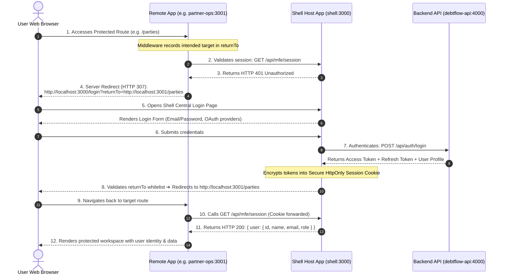

# Authentication & Single Sign-On (SSO) Flow

This document details the centralized authentication architecture, security model, and complete login/session lifecycle for the **Debt Flow Micro Frontend** workspace.

---

## 1. Authentication Architecture Overview



---

## 2. Step-by-Step Flow Explanation

### Step 1: Initial Protected Route Access

- A user visits a remote application directly in standalone mode (e.g., `http://localhost:3001/parties` or `https://partner-ops.vercel.app/parties`).
- The remote's `middleware.ts` intercepts the request and sets the `x-debtflow-return-to` header with the current full URL.

### Step 2 & 3: Server-Side Session Verification

- The remote application layout (`apps/partner-ops/src/app/(workspace)/layout.tsx`) calls `getCoreIdentity()` on the server side before rendering.
- `getCoreIdentity()` queries the Shell Host's identity endpoint:
  ```http
  GET /api/mfe/session
  Host: localhost:3000
  Cookie: <forwarded_cookies>
  ```
- If no valid session cookie exists, the Shell returns `HTTP 401 Unauthorized`.

### Step 4 & 5: Centralized Redirection to Shell Host

- The remote application triggers a clean server-side redirect:
  ```http
  HTTP/1.1 307 Temporary Redirect
  Location: http://localhost:3000/login?returnTo=http://localhost:3001/parties
  ```
- The user's browser opens the centralized login page hosted by `@debtflow/shell`.

### Step 6 & 7: Authentication & Token Encryption

- The user inputs credentials (or chooses an OAuth provider such as Google).
- NextAuth.js on the Shell server verifies the credentials against `debtflow-api`:
  ```http
  POST /api/auth/login
  Content-Type: application/json

  {
    "email": "admin@debtflow.local",
    "password": "..."
  }
  ```
- Upon successful authentication, the Backend returns a short-lived **Access Token** and a long-lived **Refresh Token**.
- **Security Guarantee:** Tokens are encrypted into an **HttpOnly, SameSite=Lax, Secure Cookie** managed by NextAuth.js. No client-side JavaScript can ever access the raw tokens (immune to XSS).

### Step 8 & 9: Whitelisted Return Redirection

- Before redirecting, the Shell verifies that `returnTo` matches one of the origins in `AUTH_ALLOWED_RETURN_ORIGINS` (preventing Open Redirect vulnerabilities).
- The browser is redirected back to the original destination (`http://localhost:3001/parties`).

### Step 10, 11 & 12: Verified Identity Resolution

- The remote app checks session status again via `GET /api/mfe/session`.
- With the newly issued session cookie in place, the Shell returns the verified user identity:
  ```json
  {
    "user": {
      "id": "usr_123",
      "name": "Admin User",
      "email": "admin@debtflow.local",
      "role": "ADMIN"
    }
  }
  ```
- The remote app renders the workspace header, navigation permissions, and domain data.

---

## 3. Silent Token Refresh Mechanism

To prevent users from being abruptly logged out during active sessions, `@debtflow/shell` implements an automated server-side token refresh:

```text
┌─────────────────────────────────────────────────────────────────────────┐
│                        Token Refresh Buffer Flow                        │
│                                                                         │
│  1. JWT Callback checks expiration timestamp.                           │
│  2. If (ExpiresAt - Date.now() < 60,000ms):                             │
│     Shell calls Backend: POST /api/auth/refresh { refreshToken }        │
│  3. New Access Token is encrypted into session cookie transparently.    │
│  4. User experiences ZERO interruption or re-login prompts.             │
└─────────────────────────────────────────────────────────────────────────┘
```

---

## 4. Multi-Domain & Cross-Origin Configuration

### Environment Variables Matrix

| Variable                      | App                | Purpose                                                         |
| :---------------------------- | :----------------- | :-------------------------------------------------------------- |
| `AUTH_SECRET`                 | `apps/shell`       | 32-byte secret used to sign and encrypt session cookies         |
| `AUTH_URL`                    | `apps/shell`       | Base URL of the Shell authentication server                     |
| `AUTH_ALLOWED_RETURN_ORIGINS` | `apps/shell`       | Whitelisted origins allowed to receive post-login redirects     |
| `PLATFORM_ORIGIN`             | `apps/partner-ops` | Target Shell origin used for login redirects and session checks |

### Production Sub-Domain Sharing (`*.debtflow.vn`)

In production environments sharing a common root domain:

- Configure cookie domain on Shell: `Domain=.debtflow.vn`
- Session cookies are automatically dispatched to `app.debtflow.vn`, `partner.debtflow.vn`, and `payments.debtflow.vn`.
